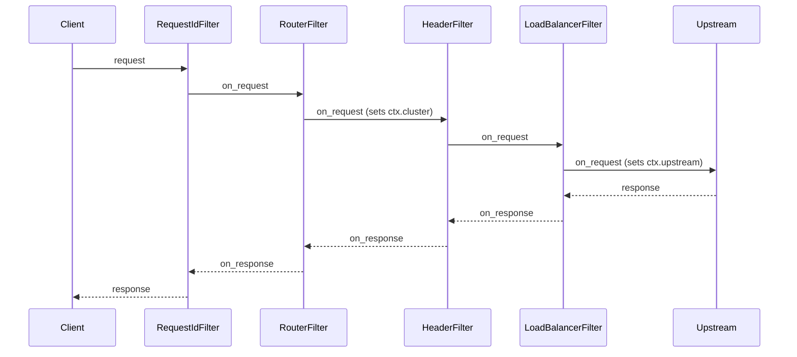
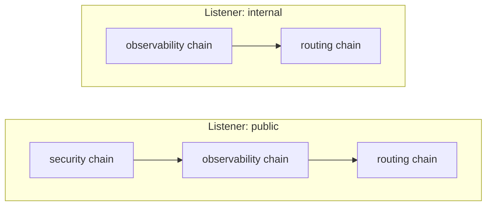
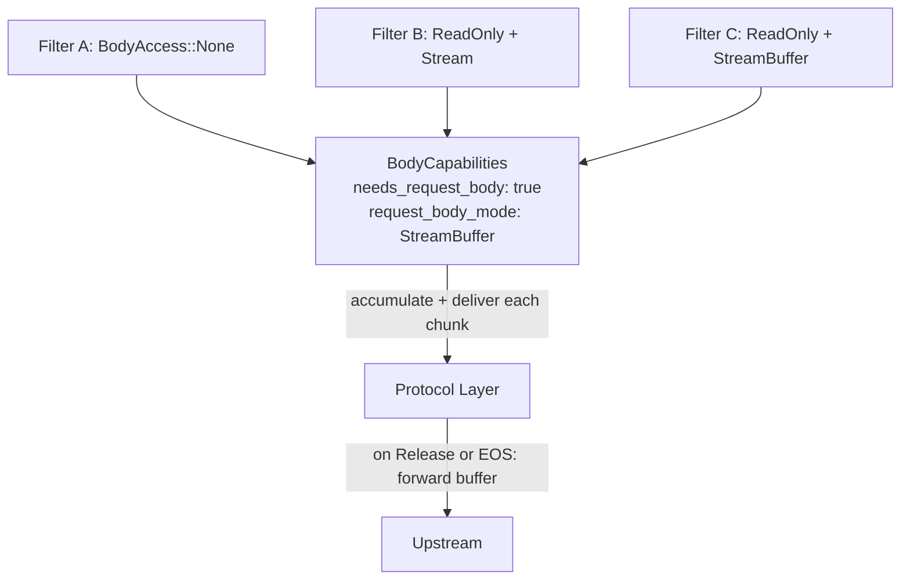

# Filter Pipeline & Branch Chains

This page covers the filter pipeline execution model, payload processing,
and the condition system that controls filter execution.

## Filter-First Design

Every behavior in Praxis is a filter. Built-in filters use the same
traits as user-provided filters. Filters are chained into pipelines;
the pipeline executor calls each filter in order on requests and in
reverse on responses.

Any filter can short-circuit the pipeline by returning a `Reject` action,
which immediately sends a response to the client without continuing
to the next filter or contacting the upstream.

## Filter Chains

Filter chains are named, reusable groups of filters defined
at the top level of the config. A listener references one or
more chains by name; the filters are concatenated in order
to form that listener's pipeline.

This enables reuse without duplication. A "security" chain
can be shared across public listeners while internal
listeners skip it entirely.

## Payload Processing

Filters declare body access needs at construction time via
`request_body_access()`, `response_body_access()`, and the
corresponding `*_body_mode()` methods. The pipeline
pre-computes aggregate `BodyCapabilities` at build time so
the protocol layer knows whether to buffer or stream.

Two delivery modes:

- **Stream**: chunks flow through filters as they arrive.
  Low latency, low memory.
- **StreamBuffer**: chunks are delivered to filters
  incrementally (like Stream) but accumulated in a buffer
  and not forwarded to upstream until a filter returns
  `FilterAction::Release` or end-of-stream. After release,
  remaining chunks flow through in stream mode. No size
  limit by default; an optional `max_bytes` returns 413
  when exceeded. Enables streaming inspection with deferred
  forwarding for AI inference, Agentic networks, and
  Security systems use cases including content scanning,
  payload inspection, and body-based routing.

When StreamBuffer mode is active, the protocol layer
pre-reads the body during the request phase (before
upstream selection) so that body filters can influence
routing decisions. The pre-read body is stored and
forwarded to the upstream after the connection is
established.

Precedence: `StreamBuffer` > `SizeLimit` > `Stream`. If
any filter requests `StreamBuffer`, the pipeline uses
stream-buffered mode.
Global `body_limits.max_request_bytes` / `body_limits.max_response_bytes`
config limits force buffer mode for size enforcement even
when no filter requests body access.

The `on_response_body` hook is synchronous (not async)
because Pingora's `response_body_filter` callback is `fn`,
not `async fn`.

## Filter Condition System

Filters can be conditionally executed based on request or
response attributes. Each `FilterEntry` carries optional
`conditions` (request phase) and `response_conditions`
(response phase).

Condition types:

- **`when`**: execute the filter only if the predicate
  matches
- **`unless`**: skip the filter if the predicate matches

Request predicates: `path`, `path_prefix`, `methods`,
`headers`. Response predicates: `status`, `headers`. All
fields within a predicate use AND semantics; multiple
conditions short-circuit in order.

Request conditions gate both `on_request` and body hooks.
Response conditions gate only `on_response` and response
body hooks.

## Branch Chains

Conditional branching in filter pipelines based on
filter results. Key concepts:

- **Branch conditions** evaluate filter results to decide
  which execution path to take
- **FilterResultSet** stores results from filters without
  the filters needing to know about branching
- **Rejoin points** control where branches merge back into
  the main pipeline (next filter, terminal, named filter,
  or re-entrance with iteration limits)

The pipeline executor reads results from `FilterResultSet`
to evaluate branch conditions and dispatch to the
appropriate branch. Filters write results to
`FilterResultSet` without knowing about branches, keeping
filter logic decoupled from pipeline flow control.

## Dynamic Configuration Reload

Praxis swaps filter pipelines at runtime without
restarting the server or disrupting in-flight requests.

Each handler holds an `Arc<ArcSwap<FilterPipeline>>`
instead of a plain `Arc<FilterPipeline>`. On every
request, the handler calls `pipeline.load()` to get a
snapshot pinned for that request's lifetime. A reload
stores a new pipeline into the `ArcSwap`; the next
request loads the new pointer while in-flight requests
drain on the old one.

A file watcher (`notify` crate, 500ms debounce) monitors
the config file. On change it validates the new config,
rebuilds all pipelines, and swaps them atomically. If
validation fails, nothing changes.
