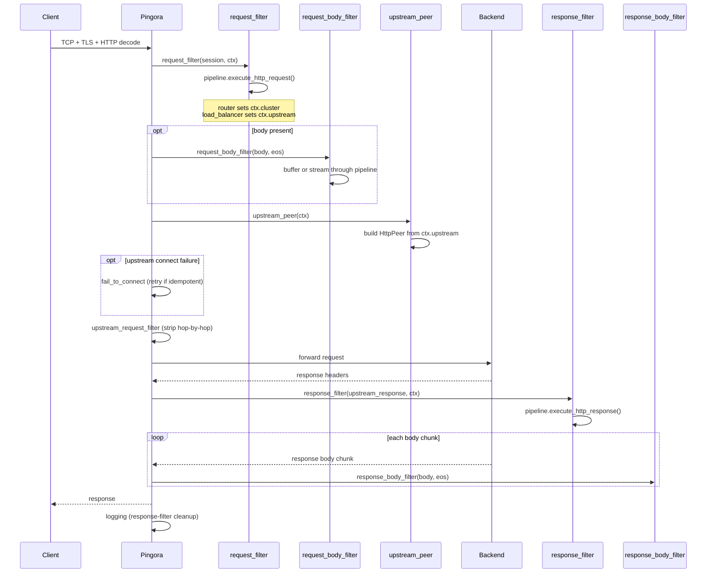

# Pingora Integration

Praxis uses [Pingora](https://github.com/cloudflare/pingora), Cloudflare's
open-source HTTP proxy framework, as the foundation for protocol handling.
This page covers how Praxis integrates with Pingora and the responsibilities
of each layer.

## Protocol Adapters

Adapters translate Pingora's callback-based API into Praxis filter pipeline
invocations. When feasible, Praxis owns no protocol logic, instead handing
it off to Pingora's well-maintained and battle-tested implementations.

```text
HTTP  --> praxis-protocol/http  --> Pingora
TCP   --> praxis-protocol/tcp   --> Pingora
QUIC  --> praxis-protocol/http3 --> Quiche  (planned, not yet implemented)
```

These adapters are modular. New protocols can be added by writing new
adapters, and multiple implementations of a single protocol can be swapped
via build features or runtime configuration.

## PingoraServerRuntime

`PingoraServerRuntime` wraps the underlying Pingora server. Protocols call
`Protocol::register()` to add their listeners, then the runtime runs all
protocols on a single server. This enables mixed HTTP + TCP listeners in
one process.

Add new protocols by writing an adapter that implements
`Protocol::register()`.

## HTTP Connection Lifecycle

The HTTP adapter maps Pingora's `ProxyHttp` trait callbacks to the Praxis
filter pipeline:



1. TCP accept, TLS handshake, HTTP decode (Pingora)
2. `request_filter`: pipeline runs filters in order; router
   sets `ctx.cluster`, load balancer sets `ctx.upstream`
3. `request_body_filter`: buffer or stream body chunks
   through filters (if any filter declares body access)
4. `upstream_peer`: converts `ctx.upstream` to `HttpPeer`
5. Connect to upstream; `fail_to_connect` retries
   idempotent requests on failure
6. `upstream_request_filter`: strips hop-by-hop headers
7. Request forwarded, response headers received
8. `response_filter`: pipeline runs filters in reverse
9. `response_body_filter`: stream response body through
   filters (synchronous; Pingora constraint)
10. `logging`: re-runs response filters if response
    phase was skipped (upstream error, filter rejection)
11. Connection returned to pool

## HTTP Correctness

A proxy must enforce HTTP invariants that upstream servers
and downstream clients may not. The Praxis project _strongly_ prefers
relying on [Cloudflare](https://cloudflare.com)'s protocol
implementations whenever feasible.

- For TCP, we rely on [Pingora](https://github.com/cloudflare/pingora)
- For HTTP/1 + HTTP/2, we rely on [Pingora](https://github.com/cloudflare/pingora)
- For QUIC + HTTP/3, we rely on [Quiche](https://github.com/cloudflare/quiche)

### What Pingora Handles

Pingora 0.8.x handles several correctness concerns at
the framework level:

- **Request smuggling**: Content-Length vs
  Transfer-Encoding validation per
  [RFC 9112](https://datatracker.ietf.org/doc/html/rfc9112).
  Invalid Content-Length headers are rejected. Request
  body draining before connection reuse.
- **Backpressure**: H2 flow control and bounded H1
  channels between upstream reader and downstream writer.
- **Connection pool safety**: connections are only pooled
  when requests complete cleanly. Unconsumed response
  bodies cause the connection to be discarded.

### What Praxis Handles

- **Hop-by-hop headers**: Praxis strips `Connection`,
  `Keep-Alive`, `Transfer-Encoding`, `TE`, `Trailer`,
  `Upgrade`, and `Proxy-Authenticate`, plus any custom
  headers declared in the `Connection` header value.
  Stripping is applied on both request and response paths
  per [RFC 9110 Section 7.6.1](https://datatracker.ietf.org/doc/html/rfc9110#section-7.6.1).
- **Host header validation**: Praxis rejects requests
  with conflicting `Host` headers (400) and
  canonicalizes duplicate identical values.
- **Proxy headers**: Praxis injects `X-Forwarded-For`,
  `X-Forwarded-Proto`, and similar headers with
  configurable trust boundaries via the `forwarded_headers`
  filter.
- **Reserved internal headers**: Praxis uses
  `x-praxis-*`, `x-mcp-*`, and `x-a2a-*` prefixes
  for proxy-internal routing metadata.
- **Retry safety**: retries only apply to idempotent
  requests where no bytes have been written upstream.
